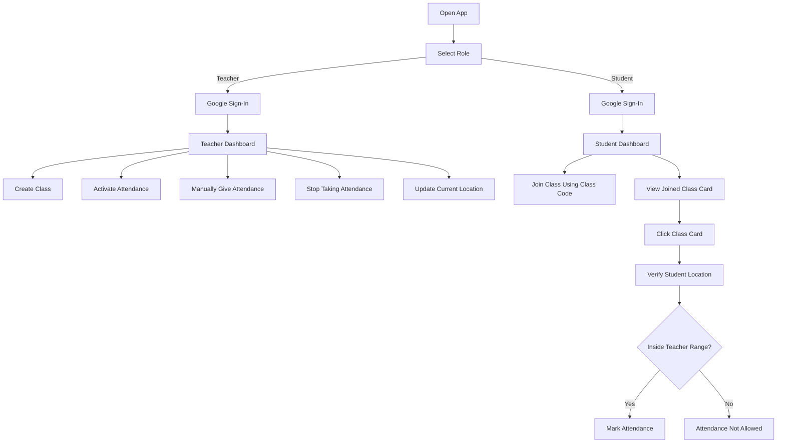

# 📱 BioTend — Smart Attendance App


### An Android application for **smart, secure, and location-based attendance tracking** built using **Kotlin**, **Jetpack Compose**, and **Firebase Firestore**.

---

## 🌟 Overview

**BioTend** is a modern Android attendance system designed for educational institutions. It combines **GPS-based geofencing** and **biometric authentication** to ensure students can only mark attendance when they are physically present in the classroom. Teachers get full control over attendance sessions with real-time monitoring and manual override capabilities.

---
## 📸 Screenshots

<p align="center">
  
  
  
</p>

<p align="center">
  
  
  
</p>

---
## 📱 Project Flow




---
## 🚀 Features

### 🔐 Authentication
- Google Sign-In for seamless and secure login.
- Device-bound access to prevent proxy attendance.

### 🧑‍🏫 Teacher Panel
- Create and manage class attendance cards.
- Set custom geolocation coordinates and distance thresholds.
- Manually mark or override student attendance when needed.
- View live count of students who have joined each class.
- Real-time attendance monitoring dashboard.

### 🧑‍🎓 Student Panel
- Join classes instantly via a unique subject code.
- Location + biometric-based attendance validation.
- One-time attendance marking per session to prevent duplicates.
- Real-time feedback on attendance status.

### 📡 Firebase Integration
- **Firestore** for storing classes, students, and attendance logs.
- Real-time data sync using Firestore listeners.
- Offline support with local persistence via Firestore cache.
- **Firebase Authentication** for secure identity management.

---

## 🛠 Tech Stack

| Technology | Purpose |
|---|---|
| **Kotlin** | Primary programming language |
| **Jetpack Compose** | Declarative UI framework |
| **Firebase Firestore** | Cloud NoSQL database |
| **Firebase Authentication** | User authentication |
| **DataStore** | Local key-value preferences storage |
| **WorkManager** | Background task scheduling |
| **Location Services** | GPS-based geofencing |
| **Biometric API** | Fingerprint / face authentication |

---

## 📝 How It Works

1. **Teacher Login** — Teachers log in via Google and create attendance session cards with geofence rules.
2. **Student Join** — Students join a class using a subject code shared by the teacher.
3. **Attendance Marking** — The app validates the student's GPS location within the defined radius and then prompts biometric authentication.
4. **Real-Time Monitoring** — Teachers see attendance counts update live as students mark in.
5. **Manual Override** — Teachers can manually mark or correct any student's attendance.

---

## ⚙️ Getting Started

### Prerequisites

- Android Studio **Hedgehog** or later
- JDK 17+
- A Firebase project with **Firestore** and **Authentication** enabled

### Setup

1. **Clone the repository**
   ```bash
   git clone https://github.com/shyam21biswas/BioTend.git
   cd BioTend
   ```

2. **Connect Firebase**
   - Go to the [Firebase Console](https://console.firebase.google.com/).
   - Create a new project (or use an existing one).
   - Add an Android app with your package name.
   - Download the `google-services.json` file and place it in the `app/` directory.
   - Enable **Firestore Database** and **Google Authentication** in the Firebase Console.

3. **Build & Run**
   - Open the project in Android Studio.
   - Sync Gradle dependencies.
   - Run the app on an emulator or physical device (API 26+).

---


## 🤝 Contributing

Contributions are welcome! Here's how you can help:

1. Fork the repository.
2. Create a new branch: `git checkout -b feature/your-feature-name`
3. Make your changes and commit: `git commit -m 'Add some feature'`
4. Push to the branch: `git push origin feature/your-feature-name`
5. Open a Pull Request.

> For major changes, please open an issue first to discuss what you'd like to change.

---

## 📄 License

This project is licensed under the **MIT License**. See the [LICENSE](LICENSE) file for details.

---

<div align="center">
  Made with ❤️ by <a href="https://github.com/shyam21biswas">shyam21biswas</a>
  <br/><br/>
  If you find this project useful, please consider giving it a ⭐️!
</div>
